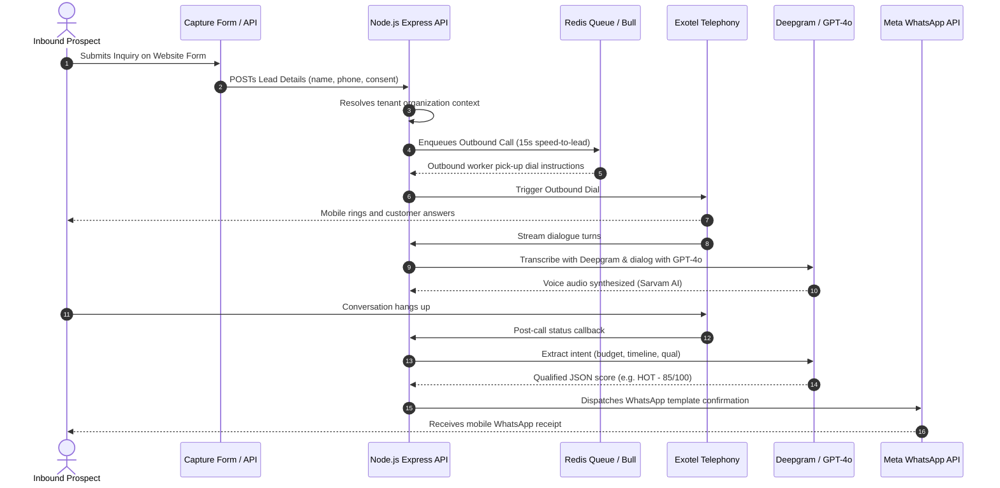

# LeadFlow-AI — India's First 90-Second AI CRM Platform
> Production-grade automated conversational speed-to-lead outbound CRM system.

LeadFlow-AI immediately dials your leads using ultra-natural voice synthesizers (supporting Hindi & B2B English) in under 90 seconds. It records the conversation, performs speech-to-text with Deepgram, extracts customer intent with GPT-4o, automatically scores prospects into HOT/WARM/COLD, sends official Meta WhatsApp follow-ups, and notifies your sales reps.

---

## 🏗️ System Architecture & Workflow



---

## 🛠️ Complete Technology Stack

| Layer | Component | Implementation |
| :--- | :--- | :--- |
| **Backend Core** | Runtime Environment | Node.js, Express, Helmet, CORS, HPP |
| **Database** | Relational Store | Supabase PostgreSQL Engine (Pooled connections) |
| **ORM** | Schema & Migration | Prisma (multi-tenant logical filtering by `organizationId`) |
| **Queue Manager** | Background Processors | Redis v7 + Bull Queue Workers |
| **Outbound Voice** | Telephony Platform | Exotel API (Interactive TwiML loops) |
| **Audio Synthesizer** | Voice Synthesis | Sarvam AI TTS (Ultra-natural Meera Hindi voice) |
| **NLP & AI** | Transcription & Dialogue | Deepgram Speech-to-Text & OpenAI GPT-4o |
| **WhatsApp Inbox** | Inbound & Outbound | Official Meta Business Graph APIs |
| **Payment Gateway** | Subscription Engine | Razorpay Recurring Subscriptions with HMAC signature verification |
| **Frontend App** | UI Dashboard Portal | Next.js 14 App Router, Zustand, Tailwind CSS, Recharts |

---

## ⚡ Quick Start Setup Guide

### 1. Environment Configurations
Prepare a `.env` file in the `backend/` directory based on the following template:
```env
PORT=5000
NODE_ENV=production
DATABASE_URL="postgres://postgres.xxx:6543/postgres?pgbouncer=true"
DIRECT_URL="postgres://postgres.xxx:5432/postgres"
REDIS_HOST="127.0.0.1"
REDIS_PORT=6379

# Auth
JWT_ACCESS_SECRET=min-32-char-random-secret-here
JWT_REFRESH_SECRET=min-32-char-random-secret-here
JWT_ACCESS_EXPIRES_IN=15m
JWT_REFRESH_EXPIRES_IN=7d

# App config
CLIENT_URL=https://your-domain.com
API_PREFIX=/api/v1

# Exotel
EXOTEL_API_KEY="your_exotel_key"
EXOTEL_API_TOKEN="your_exotel_token"
EXOTEL_SUBDOMAIN=your-subdomain
EXOTEL_CALLER_ID=your-virtual-number
EXOTEL_APP_ID=your-exotel-app-id

# AI & NLP
OPENAI_API_KEY="sk-proj-xxxx"
DEEPGRAM_API_KEY="your_deepgram_key"
SARVAM_API_KEY="your_sarvam_key"

# WhatsApp
WHATSAPP_API_URL=https://graph.facebook.com/v18.0
WHATSAPP_TOKEN=your-whatsapp-permanent-token
WHATSAPP_VERIFY_TOKEN=your-custom-verify-token
WHATSAPP_PHONE_NUMBER_ID=your-phone-number-id
WHATSAPP_APP_SECRET=your-facebook-app-secret

# Razorpay
RAZORPAY_KEY_ID="rzp_live_xxx"
RAZORPAY_KEY_SECRET="your_rzp_secret"
RAZORPAY_WEBHOOK_SECRET=your-webhook-secret

# SendGrid
SENDGRID_API_KEY="your_sendgrid_key"
FROM_EMAIL=noreply@leadflowai.com
FROM_NAME=LeadFlow-AI

# Cloudinary
CLOUDINARY_CLOUD_NAME=your-cloud-name
CLOUDINARY_API_KEY=your-key
CLOUDINARY_API_SECRET=your-secret

# Supabase
SUPABASE_URL=https://[project-ref].supabase.co
SUPABASE_ANON_KEY=your-anon-key
SUPABASE_SERVICE_KEY=your-service-role-key
```

### 2. Up & Running Local Databases
Boot up your Redis container and apply direct Prisma migrations:
```bash
# Start local Redis database inside background
docker-compose up -d

# Apply Schema Migrations to production DB
cd backend
npx prisma migrate deploy
npx prisma generate
```

### 3. Running Dev Servers
```bash
# In backend directory
npm run dev

# In a separate terminal inside frontend/
npm run dev
```

---

## 🛡️ Webhook Security & Signatures Verification

LeadFlow-AI implements strict verification headers to confirm webhook requests originate directly from Meta, Exotel, or Razorpay:

- **Meta Signature Check**: Meta webhooks verify incoming payloads against `X-Hub-Signature-256` matching your Facebook App Secret HMAC-SHA256.
- **Razorpay Signatures**: Razorpay subscription charged callbacks verify signatures using a strict SHA256 hashing format with your `webhook_secret`.

